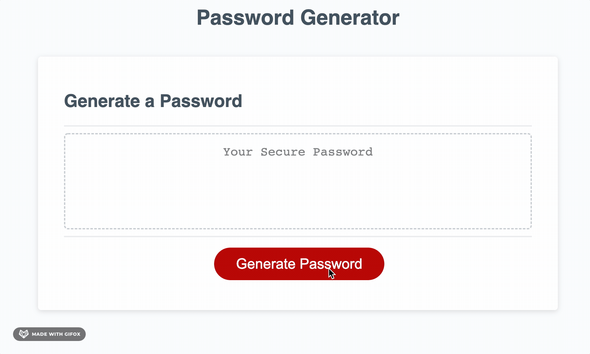

# **Password Generator**

---

## **What is Password Generator?**
**Password Generator** is a simple, free and easy to use password generator! With this password generator you can simply click the button presented in the middle of the webpage to be prompted with questions about how to format your password.

If you would like to visit the deployed site, [click here!](https://coderbennett.github.io/password-generator/)

## **Functionality**

---

As displayed in the GIF above, when navigating the site you initiate the password generation by clicking on the red generate password button.

From this point forward you will be prompted with a dialogue box requesting input from you regarding your preferences or needs on a password. 

The selections and customization options you have for passwords with this generator are to include or not include lowercase characters, uppercase characters, special characters and/or numbers.

**You *MUST* select one of the characters otherwise your password will not have any characters!!**

Once you have chosen your customization options then your password will be generated!

## **About the Author**
Hi there! My name is Joey and I am a jr. web dev! I am learning a lot about javascript with projects like this and I will have some extra notes below with the interesting things I learned and used on this project.

Feel free to reach out to me or visit other projects below:
* [GitHub](https://github.com/coderbennett)
* [LinkedIn](https://www.linkedin.com/in/joey-bennett-jkb/)
* [Portfolio](https://coderbennett.github.io/portfolio-flat/)

## **Extra Notes**

---

To create this password generator I split up the key parts into separate functions. I have listed below a quick overview of how they work below:

### **Generate Password**
The generate password function is the mother function of the generator here. Each of the functions within do most of the work. As you can see below, this function mostly just contains function invocations.

    var pwLength = passwordLength(pwLength);
    var selectedCharacters = whichChars();
    var charArray = createCharArray(selectedCharacters);
    return randomizePassword(charArray, pwLength);

*The above code snippet shows the 4 lines of code within this function.*

### **Password Length**
The password length function prompts the user for their desired password length, stores it in a variable named length, and then checks to see if the user followed the prompts instructions correctly with an if statement.

    length = prompt("How long would you like your password to be? \n(Between 8-128 characters)");

    if(length < 8 || length > 128 || isNaN(length)) {
        passwordLength(length);
    } 

*This code snippet shows the propt to the user and the if statement to ensure correct responses.*

### **Which Characters**
The which characters function uses confirm dialogue boxes to ask the user which characters they would like in their password. The user must either click OK or Cancel. If the user cancels all character choices they will be asked again.

To keep track of what choices the user makes, I am using an array with booleans representing each option.

    var passwordCharacters = [false, false, false, false];

    passwordCharacters[0] = confirm("Do you want lowercase letters in your password?");
    passwordCharacters[1] = confirm("Do you want uppercase letters in your password?");
    passwordCharacters[2] = confirm("Do you want numbers in your password?");
    passwordCharacters[3] = confirm("Do you want special characters in your password?");

*Above is a code snippet of the boolean array, and each question posed to the user.*

### **Create Character Array**
The create character array simply creates an array with all the possible characters the user could have in their password, depending on their previous choices.

The function has 4 variables initialized with all possible characters, and has four if statements which check the array from the previous function to see the user's choices of character types. If the if statement runs true, it will add all the characters from that specified type into a string.

Lastly, this function returns an array with all the characters by using the split function on the string with all the characters.

    var specialCharacters = "!@#$%^&*()_+=,./?";
    var lowercase = "abcdefghijklmnopqrstuvwxyz";
    var uppercase = "ABCDEFGHIJKLMNOPQRSTUVWXYZ";
    var nums = "0123456789";

*Above you can see the initialization of each character string.*

### **Randomize Password**
The randomize password function takes in the character array from the previous function, and the length of the password.

The function starts by initializing an array for the password and a for loop to iterate <code>length</code> number of times. Each iteration will push a random character from the character array into the password array by using <code>Math.random</code> and <code>Math.floor</code>.

The last step of this function is to use the join array method, which brings all the characters in the array together in a string.

We now have our password and from there it is written to the screen for the user!

## **Licensing**
This password generator is available under the MIT license. For licensing details see [LICENSE](LICENSE.txt) document.